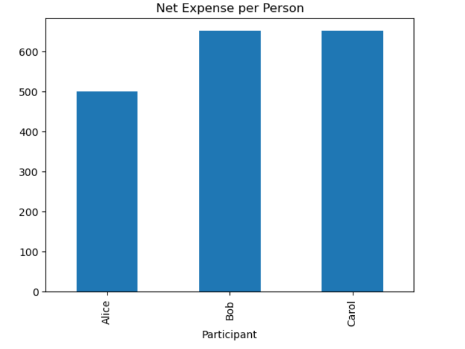
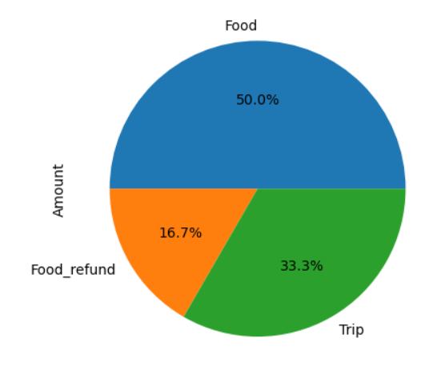
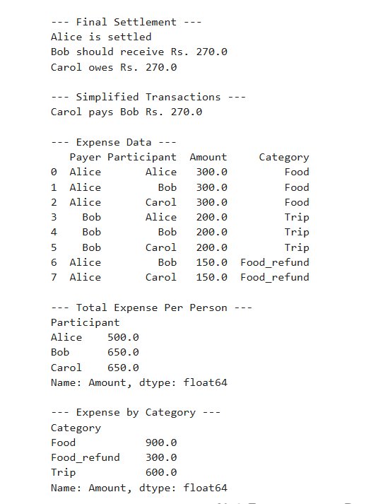

# 💰 Google Pay Inspired Expense Sharing System

---

## 📌 1. Introduction

In real-world scenarios, people often share expenses such as food, travel, rent, and group activities. Managing these shared expenses manually becomes difficult due to confusion about:

- Who paid how much?
- Who owes whom?
- How to split expenses fairly?
- How to handle refunds?

This project implements a **Google Pay / Splitwise-inspired Expense Sharing System** using Python and Data Science techniques.

---

## 🎯 2. Objective

- Fairly split expenses among users  
- Track balances (who owes / receives)  
- Support equal & weighted splitting  
- Handle refunds  
- Minimize transactions  
- Provide data analysis & visualization  

---

## 🧠 3. Core Concept

| Balance | Meaning |
|--------|--------|
| +ve | User owes money |
| -ve | User should receive money |

---

## ⚙️ 4. Methodology

### Equal Split

Share = Total Amount / Number of Participants


### Weighted Split

Alice → 50%
Bob → 30%
Carol → 20%


### Refund
- Stored as negative transaction  
- Reverses balance  

### Debt Simplification
- Reduces number of transactions  

---

# 🧭 5. System Flow (FLOWCHART)


Start
↓
Initialize Users
↓
Add Expense / Refund
↓
Split Amount (Equal / Weighted)
↓
Update Balances
↓
Store Transaction
↓
Repeat for all expenses
↓
Show Settlement
↓
Simplify Debts
↓
Perform Analysis
↓
Generate Graphs
↓
End


---

# 🏗️ 6. System Architecture


+----------------------+
| User Input |
| (Expenses, Refunds) |
+----------+-----------+
↓
+----------------------+

ExpenseSharing Class
- Users
- Balances
- Transactions
+----------+-----------+
       ↓

+----------------------+

Processing Layer
- Split Logic
- Refund Logic
- Settlement Logic
+----------+-----------+
       ↓

+----------------------+

Data Science Layer
- Pandas DataFrame
- Analysis
- Visualization
+----------+-----------+
       ↓

+----------------------+

Output Layer
- Settlement Output
- Bar Chart
- Pie Chart
+----------------------+

---

## 🔍 7. Code Logic Explanation

### Initialization
```python
self.balance = {user: 0 for user in users}

Stores balance of each user

Equal Expense
split = amount / len(participants)
self.balance[person] += split
self.balance[payer] -= split

✔ Others owe
✔ Payer receives

Weighted Expense
share = amount * weight

✔ Based on percentage

Refund
"amount": -amount

✔ Reverse transaction

Settlement
if bal > 0 → owes
if bal < 0 → receives
Debt Simplification
amount = min(debt, credit)

✔ Minimizes transactions

📊 8. Data Science Implementation

Tool	Purpose
Pandas	Data processing
NumPy	Calculations
Matplotlib	Visualization

📈 9. Analytics
Expense per person
Category-wise spending
Transaction history

📉 10. Visualization
📊 Bar Chart → user expenses
🥧 Pie Chart → category distribution

📸 11. Screenshots (ADD YOURS HERE)

📌 After running your code, take screenshots and place them in a folder called screenshots

/screenshots
    ├── 01.png
    ├── 02.png
    ├── 03.png

Then add:

### Bar Chart


### Pie Chart


### Output


⚠️ 12. Special Cases Handled

Case	Solution
Unequal sharing	Weighted split
Refunds	Negative transactions
Missing payments	Balance tracking
Multiple users	Dynamic splitting

🧪 13. Sample Execution

Input:
Alice pays ₹900
Bob pays ₹600
Refund ₹300
Output:
Final balances
Simplified payments
Graphs